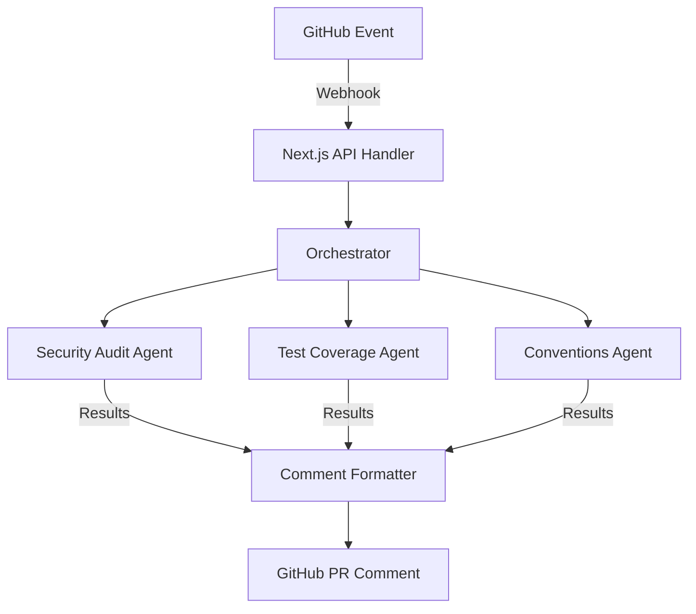

# 🤖 AI Code Reviewer

[](https://nextjs.org/)
[](https://www.typescriptlang.org/)
[](https://docs.github.com/en/webhooks)
[](https://opensource.org/licenses/ISC)

Un revisor de código automatizado que utiliza agentes de IA especializados para analizar Pull Requests en tiempo real. Este bot escucha eventos de GitHub, ejecuta auditorías paralelas y comenta directamente en el PR con sugerencias accionables.

## ✨ Características Principales

-   **Integración Nativa con GitHub:** Funciona mediante Webhooks oficiales y comenta automáticamente en los PRs abiertos o actualizados.
-   **Análisis Multimodal en Paralelo:** Lanza 3 sub-agentes especializados que trabajan simultáneamente para reducir el tiempo de respuesta.
-   **Retroalimentación Accionable:** Los comentarios están diseñados para ser claros, detallados y fáciles de aplicar por los desarrolladores.
-   **Seguridad Primero:** Validación de firmas HMAC-SHA256 para asegurar que cada petición provenga realmente de GitHub.

## 🏗️ Arquitectura de Agentes

El sistema utiliza un orquestador central que distribuye el diff del código a tres agentes con roles bien definidos:



### Agentes Especializados:
1.  **🔐 Security Audit:** Detecta vulnerabilidades, inyecciones, y patrones de código inseguros.
2.  **🧪 Test Coverage:** Evalúa si los cambios requieren nuevas pruebas y sugiere casos de borde faltantes.
3.  **📐 Conventions:** Verifica el cumplimiento de estilos, naming y estructura del proyecto.

## 📝 Ejemplo de Reporte

Así es como se ve el comentario consolidado que el bot publica en cada Pull Request:

> ### 🤖 AI Code Review
> 
> #### 🔐 Security
> ✅ Sin issues críticos detectados. Se recomienda verificar la sanitización del input en `processData`.
> 
> #### 🧪 Test Coverage
> ⚠️ Faltan tests unitarios para el nuevo helper `parseDiff`. Se sugiere cubrir casos con strings vacíos.
> 
> #### 📐 Conventions
> ❌ El archivo `Util.ts` debería seguir el naming PascalCase y estar dentro de `/lib`.

## 🛠️ Stack Tecnológico

-   **Framework:** [Next.js 16+](https://nextjs.org/) (App Router)
-   **IA:** [Anthropic Claude 4.6 Sonnet](https://www.anthropic.com/claude) & [LangChain](https://www.langchain.com/)
-   **Base de Datos/Auth:** [Supabase](https://supabase.com/)
-   **UI:** [Tailwind CSS 4](https://tailwindcss.com/), [Shadcn UI](https://ui.shadcn.com/)
-   **Testing:** [Vitest](https://vitest.dev/)

## 🚀 Configuración e Instalación

### 1. Requisitos Previos
- Node.js 18+
- Un token de acceso de GitHub (PAT) con permisos de escritura en PRs.
- Una cuenta de Anthropic para el acceso a la API.

### 2. Variables de Entorno
Crea un archivo `.env.local` basado en `.env.local.example`:

```bash
# Anthropic
ANTHROPIC_API_KEY=your_key_here

# GitHub
GITHUB_TOKEN=your_personal_access_token
GITHUB_WEBHOOK_SECRET=your_webhook_secret
```

### 3. Instalación
```bash
npm install
```

### 4. Desarrollo Local
Para probar los webhooks localmente, puedes usar una herramienta como `ngrok`:

```bash
# 1. Inicia el servidor
npm run dev

# 2. Expón el puerto 3000
ngrok http 3000

# 3. Configura el Webhook en GitHub
# Payload URL: https://tu-dominio-ngrok.app/api/webhook
# Content type: application/json
# Secret: IGUAL al de tu .env.local
```

## 📜 Desarrollo y Scripts

-   `npm run dev`: Inicia el servidor de desarrollo.
-   `npm run build`: Genera el bundle de producción.
-   `npm run test`: Ejecuta la suite de pruebas con Vitest.
-   `npm run lint`: Verifica la calidad del código.

---

Este proyecto forma parte del **Full Stack AI Developer Curriculum**. Enfocado en la implementación de sistemas multi-agente y orquestación asíncrona.
